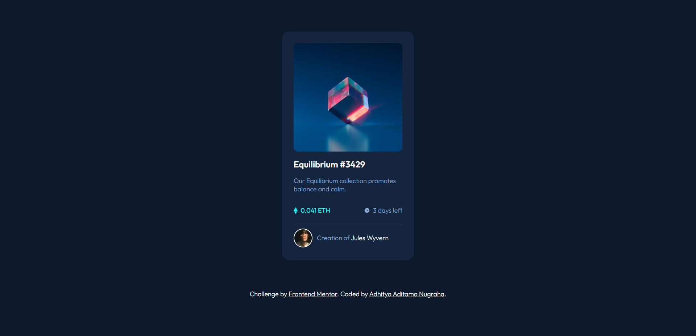
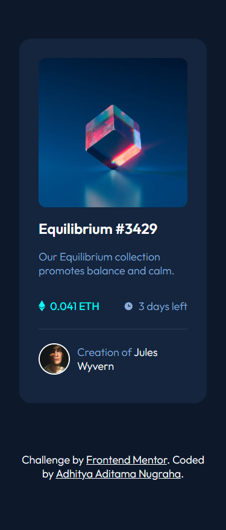

# Frontend Mentor - NFT preview card component solution

This is a solution to the [NFT preview card component challenge on Frontend Mentor](https://www.frontendmentor.io/challenges/nft-preview-card-component-SbdUL_w0U). Frontend Mentor challenges help you improve your coding skills by building realistic projects.

## Table of contents

- [Overview](#overview)
  - [The challenge](#the-challenge)
  - [Screenshot](#screenshot)
  - [Links](#links)
- [My process](#my-process)
  - [Built with](#built-with)
  - [What I learned](#what-i-learned)
- [Author](#author)

## Overview

### The challenge

Users should be able to:

- View the optimal layout depending on their device's screen size
- See hover states for interactive elements

### Screenshot

### Links

- Solution URL: [Add solution URL here](https://www.frontendmentor.io/challenges/nft-preview-card-component-SbdUL_w0U/hub)
- Live Site URL: [Add live site URL here](https://your-live-site-url.com](https://aaditamanugraha.github.io/nft-preview-card/)

## My process

### Built with

- Semantic HTML5 markup
- CSS custom properties
- Flexbox
- CSS Grid
- Mobile-first workflow

### What I learned

Understood more on how overlay image relative and position absolute works.

## Author

- LinkedIn - [Adhitya Aditama Nugraha](https://www.linkedin.com/in/aaditamanugraha/)
- Frontend Mentor - [@aaditamanugraha](https://www.frontendmentor.io/profile/aaditamanugraha)
